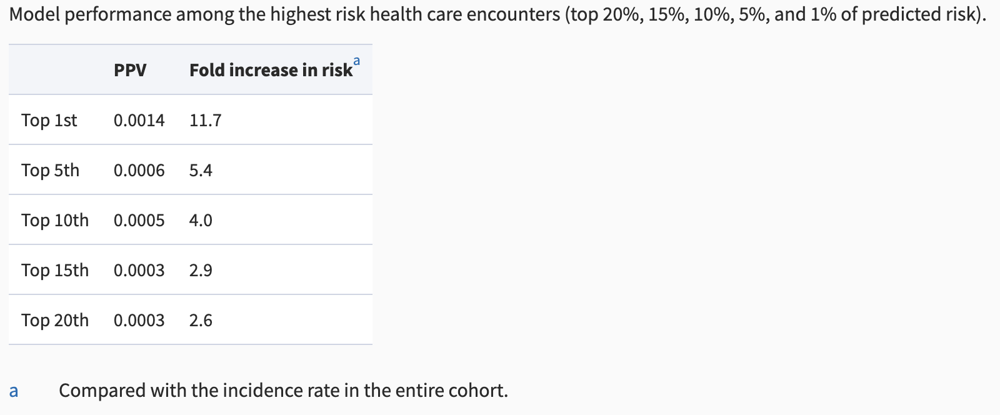

```{r setup, include=FALSE}
knitr::opts_chunk$set(echo = TRUE)
```
## Introduction
|   Many public health issues are routinely addressed by preventative healthcare, but some remain largely overlooked or undiscussed. For example, providers often screen patients for health risk factors, such as tobacco use, heavy drinking, and hypertension. These screenings allow providers to prevent or identify chronic health concerns related to these risk factors. Currently, firearm injury healthcare interventions are limited to patients who indicate thoughts of suicide. These interventions include counseling on storage, violence prevention, proper locks, and safety plans. These practices have indicated improvement in gun safety practices and reduced risk of accidental and self-inflicted firearm injuries. However, from a healthcare system's standpoint, universal screening for every patient at any appointment would prove inefficient and resource-intensive. 
|   This study – A machine-learning prediction model to identify risk of firearm injury using electronic health records data, proposes an alternative to universal screening: a statistical model that predicts the probability of a firearm injury based on a data set of potential predictors. This model will allow providers to target high-risk patients and target firearm injury risk screenings and prevention efforts towards this group. In addition, it will increase the number of high-risk patients who receive firearm injury risk screening and improve the efficiency of such screenings. However, a few elements of the study could be altered to result in better results, such as generalizing the model slightly more, reducing the number of removed predictors during the data cleaning, conducted an additional model for firearm injury, and filtering out any textual clinic biases. Additionally, this study raises a few ethical concerns, such as the usage of patient data and the potential exclusion of groups that don’t meet the ‘high-risk’ classification.  


## Methods

### Explanation of Methods
|   This study uses information from the Kaiser Permanente Southern California (KPSC) electronic health records. KPSC is a large healthcare system that operates in Southern California and provides medical and preventative care to over 5 million members, all of which are recorded in the electronic health records. This study was approved by the KPSC Institutional Review Board (IRB), which ensures its compliance with ethical standards, including protection of privacy and confidentiality. Researchers also obtained a waiver of consent, which means that securing consent was most likely not feasible and the study has minimal risk of breaching privacy. The cohort and predictor set were built using SAS Enterprise Guide 9.4 and the prediction model was built and validated using R version 4.0.4.  
|   Researchers identified all adult KPSC patients with a documented firearm injury, at least 1 in-person healthcare encounter between 2010 and 2018, and had a healthcare encounter no less then three years before the index date (the date of firearm injury, or in the case of multiple, the earliest firearm injury). All patient encounter information – including primary and specialty care encounters, urgent care, emergency department visits, and hospitalizations – in the three years prior to the firearm injury was secured for qualifying patients. Physician collaborators consider three years to be a clinically meaningful period of time and this time allowed a larger number of patients to be included, even if they didn’t use the healthcare system more than once every three years.  
|   The testing data was selected intentionality and the healthcare encounters of patients with the most recent 20% of injuries and encounters of patients with non-firearm cases from the same day were reserved for final model testing. The remainder of the data was split into training (70%) and validation (30%) data.  
|   Since the firearm injury prevalence is very low (0.01% of the total healthcare encounters during 2010-2018), they randomly selected 5 control patients for each firearm case to improve model performance even with the highly imbalanced data. The control patients had not experienced a firearm injury and had a healthcare encounter within one year of each case injury date.  
|   The predictor dataset consisted of over 170 variables, including but not limited to age, gender, healthcare visits, diagnoses, neighborhood crime rates, and household income. They were compiled based on an extensive literature review, physician input, and structured or unstructured clinical provider notes. Predictors with more than 40% missing data or two predictors with a correlation of 0.8 or higher were excluded from the predictor set to limit repetition. Information on suicidal thoughts, behaviors, and attempts recorded in unstructured clinical notes were extracted using a natural language processing (NLP) approach, and self or non-self-inflicted firearm injuries were predicted separately by conducting sensitivity analyses.  
|   Predictor categories were sorted into predictor domains, which included current indication/history of suicidal ideation or attempts, individual-level socio-demographic characteristics, individual-level clinical and healthcare utilization variables, and census tract-level neighborhood information. Individual-level data was collected during usual care and individual-level socio-demographic and clinical data was collected based on the medical record number (MRN) unique to each patient. California state death certificate information was linked to each patient's social security number. Finally, each patient's address was geo-coded (transforming a description of a location to a location on the earth’s surface) to the census tract where the patient resided.  
|   This study used XGBoost, an “optimized distributed gradient boosting library designed to be highly efficient, flexible, and portable (XGBoost documentation).” It was chosen because it has shown high performance in various situations, properly handles missing data, flexibly accommodates non-linear associations and interactions, and does not require the analyst to specify the model structure a priori (reasoning from self-evident propositions before examination or analysis). XGBoost was used to predict the combined fatal and nonfatal injuries. To prevent overfitting and maximize efficiency, they used 5-fold cross-validation when training and pruning the model. Sensitivity, specificity, and positive predictive value (PPV) at a probability cutoff of 0.2% were used to assess the model performance.  
|   Several hyper-parameters are used by XGBoost to accomplish best performance. ‘Eta’ adjusts the learning rate of the model and shrinks the weights of features after each round to prevent overfitting. ‘Gamma’ prevents overfitting and controls the penalty on coefficients that don’t improve the performance (regularization). ‘Max_depth’ refers to the maximum depth of a tree and when increased, it heightens the complexity and likelihood of overfitting. Subsample,  the number of samples applied to a tree, occurs once each boosting iteration and prevents overfitting. ‘Colsample_by_tree’ is the number of variables supplied to a tree. ‘Lambda’ is the L2 regularization term that improves generalization and reduces overfitting. ‘Scale_pos_weight’ is useful for unbalanced classes and controls the balance between positive and negative weights. Finally, ‘nrounds’ is the number of boosting iterations, or steps required. Using Bayesian optimization, the parameters that achieved the highest accuracy were selected for the final set.  
|   While all predictors were part of the initial prediction model, they used the gain metric – the improvement in accuracy attributed to a feature – to measure the feature importance and ranked each by contribution to prediction success. They observed a variable importance drop with a gain of 0.017, which narrowed the predictor set to 15 predictors. The full set had a sensitivity of 0.84 and the 15 predictor set had a sensitivity of 0.83. Since the sensitivity difference was not drastic, researchers concluded that accuracy would not differ dramatically and chose the reduced variation as the final prediction model. After assessing overfitting possibilities and ensuring performance by applying the model to the validation data set, the test dataset was applied to the final model.  
|   With the creation of this model, researchers aimed to identify a high-risk group and maximize the resource allocation and efficiency of firearm injury screening. The intent is to focus resources on groups that are most likely to be impacted, which will increase awareness regarding gun safety practices.  
 
### Analysis of Methods  
|   The study was was very detailed and focused heavily on maintaining accuracy in its results. However, in the strive for accuracy, the model became overfitted and unable to accurately predict anything broader then the top 1% of risk. Based on methodology, the blind acceptance of clinical provider notes may have resulted in accidental bias due to, often unintentional, human bias. In addition, the preemptive removal of predictors during the data cleaning process was slightly more extensive then I think it should have been, which may have eliminated possibly high-influencing factors. Finally, I think an additional model should have been trained using only self-inflicted firearm injuries, allowing clinical providers a more specialized prediction model if they suspect suicidal behaviors related to firearms.  

|   . 

|   Based on the Figure One, I concluded that the model was most accurate for the top 1% of predicted risk, but decreases as the risk group becomes more broad. This suggests overfitting within the model, which was likely the result of an emphasis on accuracy. Since the goal of the predictive model is to accurately identify ‘high-risk’ patient encounters, doctors advised the researchers to place heavy emphasis on maintaining accurate results. It appears that this led to diminished predictive power as the risk group becomes more broad. This creates the possibility of disadvantaging groups with lower risk. Although the goal of the model is to create a 'high-risk' group to target with resources, the accuracy portrayed in Figure One displays accuracy for a very small percentage that will fall into this group. Even people in the top 5% of risk will not be accurately predicted since from 1% to 5%, the model loses significant value in the fold increase in risk.  
|   Although the PPV values appear very low in the results, since the rate of firearm injury is so low (0.01% of healthcare encounters from 2010-2018), in actuality it indicates that the model is performing well. However, when we look at the decrease from 1% to 5%, similarly to the fold increase in risk, the model has a dramatic decrease. 
|   Overall, these results indicate that the model is most accurate when predicting the 1% of risk, which may be what the study intended. The researchers did not how low/high the risk percentage should be. However, I think that although the goal is predicting the small group of 'high-risk' patients, the model should be accurate for at least 1-5% of risk. Therefore, I think the model was overfit and should be slightly more generalized to allow for accurate prediction of a slightly larger group. 
|   To alleviate the overfitting, researchers could tweak the XGBoost hyper-parameters. The initial hyper-parameters were tuned for the highest possible accuracy and in order to slightly broaden the group percentage that is being accurately predicted, they could slightly decrease the learning rate to help the model generalize a bit better. This being said, the goal of this predictive model is accurate prediction of a very small risk group, so the learning rate should only be slightly lowered. By generalizing slightly, the model could predict people that are close to the 1% of risk before they officially reach that point.  
|   Due to the functionality of XGBoost, removing similar predictors is necessary before inputting data. However, one of the benefits of XGBoost is its ability to automatically handle missing data. Therefore, removing all predictors with more than 40% missing data was not necessary and could have harmed the accuracy of the predictor model. If I was reconducting this study, I would change the percentage to 50%. While there is significance to eliminating factors that have incomplete data present, it eliminates potentially important elements. Therefore, I would change this exclusion percentage to 50%, so that if a predictor had at least half of the data present, it would be included and have the potential to weigh into the predictor models decisions.  
|   I would also separate the self-inflicted and non-self-inflicted predictions differently. The study did not go into depth on the way they calculated these and just reported that they were predicted separately based on sensitivity analysis. In the results, they clarify further, stating that since both had the same 15 predictors and when separated, the prevalence for each decreased, they ended up combining self and non-self-inflicted injuries. I agree that instead of separating these cases completely, I would instead leave the complete data for firearm predictions. If the self-inflicted data was removed completely from the dataset, it eliminates a group of subjects that may be high-risk for non-self-inflicted firearm injury. However, I would additionally conduct a separate self-inflicted prediction. If a subject revealed suicidal thoughts, this does not automatically exclude them for risk of other firearm scenarios, but if an additional predictor model was created, self-inflicted injuries could also be identified and dealt with specifically. Therefore, I would not separate the data set for firearm prevalence and for an additional model, filter out cases with suicidal behaviors for a separated self-inflicted prediction.  
|   Finally, I would have been cautious about the clinical provider notes that were included in the study. Clinical providers are not free from all personal biases and even if unintentional, this could have translated into notes. While the entire list of predictors was not made public, I would be specifically weary of notes for predictors that could include any element of opinion and accidental bias, such as home life, family dynamic, new/potential diagnoses, and general notes on healthcare visits. While I understand the necessity of including predictors based on clinical provider notes, it is not realistic to assume that providers show no purposeful or accidental bias. In order to filter out potentially opinionated or bias clinical provider notes, the study could have utilized a text-analysis software that flags words that have negative or positive connotations, then approved the context for each of these. If an instance of notes included emotional connotations that were unnecessary or seemed to convey any element of provider opinion, they could be verified by other sources or removed before they created any bias in the predictor model.  
 	
 	
## Analysis of Normative Consideration
|   The issue of data privacy was alleviated by approval of the Kaiser Permentente Instritutional Review Board (KPIRB) but is somewhat threatened by the approval of a waiver of consent. An Institutional Review Board (IRB) is a committee charged with protecting the rights and welfare of the people involved in a study. An approved waiver of consent means subjects will not be infomed that they are included in the study, will not have the option to opt out of the study, and won’t be provided any information typically involved in the conset process. With the approval of a waiver of consent, the KPIRB determined that there was no more than minimal risk to subjects, research could not continue without the waiver, if identifiable information is released publically, it is absolutely mandatory to the success of the study, the waiver will not negatively impact the rights of subjects, and if possible, subjects will receive information after the conclusion of the study.  
|   As indicated by inclusion of the waiver of consent, the subjects were not notified or given the opportunity to provide informed consent. Two forms of identifiable information were included: written and geo-coded patients addresses and the social security numbers of deceased patients. While this data was signifigant for the predictor model, it should have been approved by patients. Instead, the study utilized personal location information for patients without their knowledge or consent. Since subjects provided information in a medical context, they also did not provide tacit conset, as the precedent is that medical information is confidential. In addition, While the legal obligations of IRB approval and waiver of consent are met, the study failed to meet the ethically-based data privacy and consent guidelines defined in class. 
|   Regardless of legal guidelines, the failure to explicity notify and receive consent from subjects is a violation of the philosophical framework of Deontology, which requires an action to be universally acceptable and use moral agents as an ‘end,’ not a ‘means to an end’. Deontology requires an action to meet both forumations to be morally permissible. While a waiver of consent is universally acceptable from a legal standpoint, morally, it is dependent on the situation. However, with the guidelines set in place for IRB’s, it could be argued that if waivers of consent were universalized, it wouldn’t cause societal contradiction. However, using a waiver of conset in lieu of informed consent is using moral agents as a means to an end. Bypassing the data privacy – especially medical – to pursue research endeavors ignores the rights of subjects and removes their status as a ‘means’ since they are don’t gain anything from the transaction. Whether they would be receiving the satisfaction of aiding the research or receiving physical gain, the subject should be provided some sort of compensation in the process. Not doing so and refusing to give them the chance to opt out results in immoral actions when retaining data for this study.  
|   If this performance model is enacted, groups that are considered low-risk will not receive firearm injury information or screening. While there are only a finite number of resources available for firearm injury screenings and resources, determining the ‘high-risk’ individuals will not alleviate an entirely different group – those who go ‘high-risk’ locations, such as school. John Rawl argued that fairness should be based on need. His difference principle states that when there are disparities in resource allocation, they should work to the advantage of the least advantaged and most vulnerable. By allocating screenings and resources to only ‘high-risk’ individuals, the study is suggesting that victims of circumstancial firearm injury are less vulnerable and therefore, less deserving of preventative resources. According to the Pew Research Center, mass shootings have increased from 27 in 2010 to 61 in 2021. By focusing all resources and screenings on high-risk groups, the study neglects to acknowledge those who experience mass shootings, but are not necessarily part of the ‘high-risk’ group of people identified in this study. I am not suggesting that individual resource targeting is immoral, but instead that at least a portion of resources should be put towards people outside the 1%. An alternative execution of this predictive model is allocating a small portion of resources to general education in large settings, such as in schools or workplaces. Using the same predictive model format, specific settings could be targeted and general education could be distributed for the individuals in those ‘high-risk’ locations. While the majority of resources could be allocated to the targeted, high-risk groups (as the paper suggests), some general resources could be allocated for general education, alleviating the issue of exclusion and providing help to more vulnerable parties.   
|   While the study is incredibly significant when identifying high-risk homicidal or suicidal firearm injuries, it excluded low-risk groups from receiving firearm injury screenings and beneficial information on proper gun safety practices. While the paper didn’t explicitly state or contest such an inclusion, it did include phrasing that suggested all resources should be limited to high-risk groups. If even a small portion of resources were dedicated to general education on indicators for gun violence, the benefits of this study would be maximized for the most people, aligning with the moral sub-framework of utilitarianism.  


## Conclusion
|   The firearm injury predictor model is a step forward in maximizing the benefits of firearm screenings to increase future firearm safety. It identifies a group of ‘high-risk’ patients, therefore allowing clinical providers to focus firearm screening resources in the area that it will have to most impact. This study explained the data acquirement and cleaning processes and explained the extensive process behind selecting and narrowing predictors. It also thoroughly explained the use of XGBoost and how they trained and pruned the model. Finally, it provided information on the demographics of the patient data and results and accuracy of the final model. While the model had an admirable goal, there were a few steps that could be taken to improve the process. The model was only most accurate for 1% of the population, excluding people that may be close to becoming part of the most high-risk population. I suggest generalizing the model slightly to include accurate predictions for 1-5% of risk. In addition, I suggested including decreasing predictor exclusion in the primary cleaning process, creating an additional model for self-inflicted firearm injury, and filtering out potential clinical provider biases from clinical notes before using as data. The reliance on a waiver of consent due to the lack of informed consent caused moral data privacy violations. Finally,  although the goal of the study seems to align with the belief that the most vulnerable people should receive resources, the sole focus of resources on ‘high-risk’ individuals and negligence of people in high risk locations violated Rawls difference principle.    


## Resources

1. Beginners tutorial on XGBoost and parameter tuning in R tutorials & notes: Machine learning. HackerEarth. (n.d.). https://www.hackerearth.com/practice/machine-learning/machine-learning-algorithms/beginners-tutorial-on-xgboost-parameter-tuning-r/tutorial/
2. Gramlich, J. (2023, April 26). What the data says about gun deaths in the U.S. Pew Research Center. https://www.pewresearch.org/short-reads/2023/04/26/what-the-data-says-about-gun-deaths-in-the-u-s/
3. Merriam-Webster. (n.d.). A priori definition & meaning. Merriam-Webster. https://www.merriam-webster.com/dictionary/a%20priori
4. Kaiser Permanente. (n.d.). Kaiser Permanente Institutional Review Board (IRB). Retrieved December 10, 2024, from https://irb.kp-scalresearch.org/kpirb.html
5. UC San Diego. (n.d.). Consent waivers: Guidance for researchers. Retrieved December 10, 2024, from https://irb.ucsd.edu/_files/researchers/Consent-Waivers.pdf
6. XGBoost documentation. XGBoost Documentation - xgboost 2.1.1 documentation. (n.d.). https://xgboost.readthedocs.io/en/stable/
7. XGBoost parameters. XGBoost Parameters - xgboost 2.1.1 documentation. (n.d.). https://xgboost.readthedocs.io/en/stable/parameter.html#parameters-for-tree-booster
8. Zhou, H., Nau, C., Xie, F., Contreras, R., Ling Grant, D., Negriff, S., Sidell, M., Koebnick, C., & Hechter, R. (2024). A machine-learning prediction model to identify risk of firearm injury using electronic health records data. Journal of the American Medical Informatics Association, 31(10), 2173–2180. https://doi.org/10.1093/jamia/ocae222

 